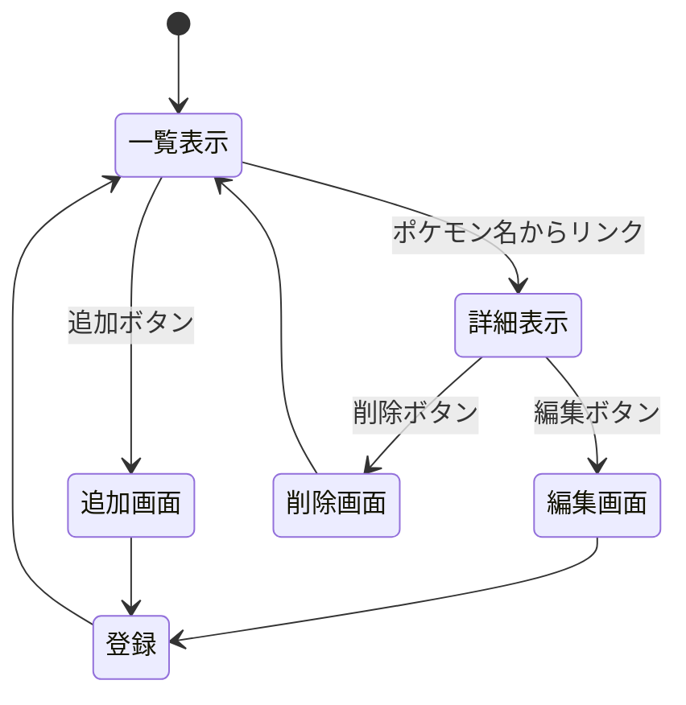

# 開発者向け仕様書
## 残念なポケモン図鑑

### データ構造
図鑑データの構造は以下のとおりである．
項目名 | 型 | 名前
-|-|-
id | 数値 | 図鑑番号
rank | 数値 | 残念度ランキング
name | 文字列 | 名前
evolution | 数値 | 進化する数
explanation | 文字列 | 図鑑説明

### ページ遷移
ページ遷移図は以下のとおりである．

### HTTPメソッドとリソース名
使用するHTTPメソッドとリソース名は以下のとおりである．
機能 | HTTPメソッド | リソース名 | パラメータ | 説明
-|-|-|-|-
一覧表示 | GET | /pokemons | なし | 登録されているポケモンの一覧ページを表示する
詳細表示 | GET | /pokemons/:id | id:図鑑番号 | 指定された番号のポケモンの詳細情報を表示する
新規登録 | POST | /pokemons | name:ポケモン名 | 新しいポケモンを図鑑に追加し，一覧画面へ戻る
削除実行 | POST | /pokemons/delete | id:図鑑番号 | 指定された図鑑番号のポケモンを削除し，一覧画面へ戻る

